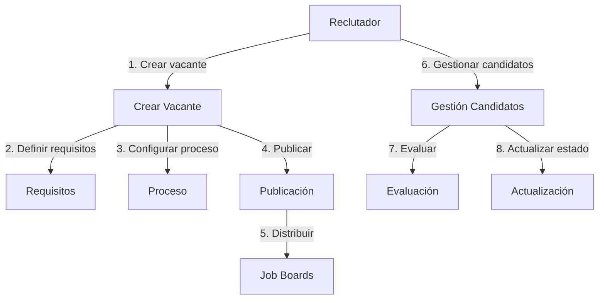
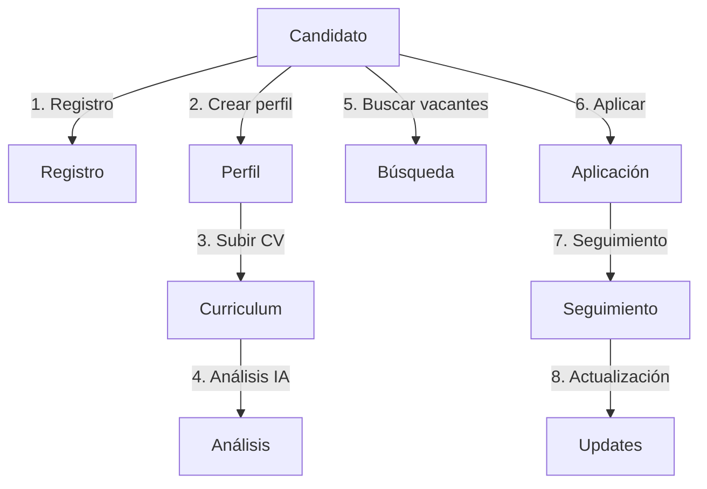
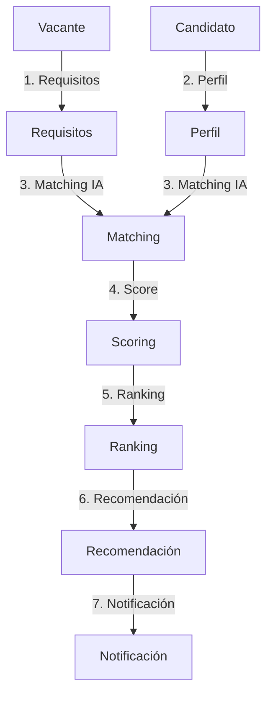
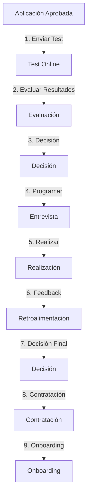

# Prompts para Generación de Diagramas

## Diagramas de Casos de Uso

### 1. Publicación y Gestión de Vacantes


Prompt utilizado:
```
Crea un diagrama de flujo que muestre el proceso de publicación y gestión de vacantes en un ATS.
El flujo debe incluir:
1. Creación de vacante por el reclutador
2. Definición de requisitos
3. Configuración del proceso
4. Publicación
5. Distribución a job boards
6. Gestión de candidatos
7. Evaluación
8. Actualización de estados
```

### 2. Aplicación y Seguimiento de Candidatos


Prompt utilizado:
```
Genera un diagrama de flujo que represente el proceso de aplicación y seguimiento de candidatos.
El flujo debe incluir:
1. Registro del candidato
2. Creación de perfil
3. Subida de CV
4. Análisis por IA
5. Búsqueda de vacantes
6. Proceso de aplicación
7. Seguimiento
8. Actualizaciones
```

### 3. Matching y Evaluación Automatizada


Prompt utilizado:
```
Crea un diagrama de flujo que muestre el proceso de matching y evaluación automatizada.
El flujo debe incluir:
1. Requisitos de la vacante
2. Perfil del candidato
3. Proceso de matching con IA
4. Cálculo de score
5. Generación de ranking
6. Recomendaciones
7. Notificaciones
```

### 4. Evaluación y Proceso de Contratación


Prompt utilizado:
```
Genera un diagrama de flujo que represente el proceso de evaluación y contratación.
El flujo debe incluir:
1. Envío de test online
2. Evaluación de resultados
3. Decisión basada en test
4. Programación de entrevistas
5. Realización de entrevistas
6. Feedback del equipo
7. Decisión final
8. Proceso de contratación
9. Inicio de onboarding
```

## Diagrama de Clases

```mermaid
classDiagram
    %% Interfaces Base
    class IController {
        <<interface>>
        +create(dto: CreateDTO)
        +update(id: string, dto: UpdateDTO)
        +delete(id: string)
        +findOne(id: string)
        +findAll(query: QueryDTO)
    }
    ...
```

Prompt utilizado:
```
Crea un diagrama de clases que represente la estructura del sistema ATS.
Debe incluir:
1. Interfaces base (IController, IService, IRepository)
2. Entidades base (BaseEntity)
3. Entidades de dominio (User, Candidate, Job, Application)
4. Entidades de evaluación (Test, TestAttempt, Interview, Hiring)
5. Servicios principales (AuthService, CandidateService, JobService, MatchingService)
6. Enumeraciones (TestType, TestStatus, InterviewType, InterviewStatus, HiringStatus)
7. Relaciones entre todas las entidades
```

## Diagramas C4

### 1. Contexto
```mermaid
C4Context
    title Sistema ATS - Diagrama de Contexto
    ...
```

Prompt utilizado:
```
Crea un diagrama C4 de contexto que muestre:
1. Personas (Candidato, Reclutador, Administrador)
2. Sistema principal (ATS)
3. Sistemas externos (Email, Job Boards, Calendario, Analytics)
4. Relaciones entre todos los elementos
```

### 2. Contenedores
```mermaid
C4Container
    title Sistema ATS - Diagrama de Contenedores
    ...
```

Prompt utilizado:
```
Genera un diagrama C4 de contenedores que muestre:
1. Frontend (SPA y App Móvil)
2. Backend (API Gateway y Servicios)
3. Bases de datos
4. Sistemas de caché
5. Colas de mensajes
6. Sistemas externos
7. Relaciones entre contenedores
```

### 3. Componentes
```mermaid
C4Component
    title Sistema ATS - Diagrama de Componentes
    ...
```

Prompt utilizado:
```
Crea un diagrama C4 de componentes que muestre:
1. Componentes internos de cada contenedor
2. Responsabilidades de cada componente
3. Relaciones entre componentes
4. Tecnologías utilizadas
```

### 4. Código
```mermaid
C4Component
    title Sistema ATS - Diagrama de Código
    ...
```

Prompt utilizado:
```
Genera un diagrama C4 de código que muestre:
1. Estructura de clases
2. Interfaces
3. Relaciones entre clases
4. Métodos principales
5. Atributos importantes
```