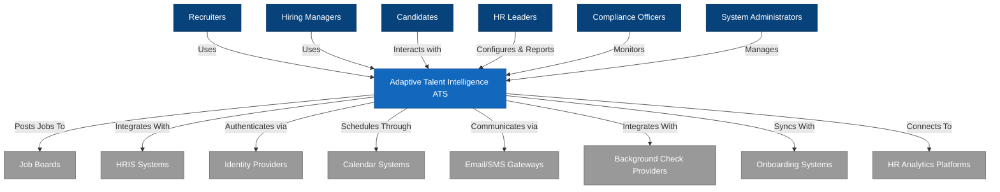
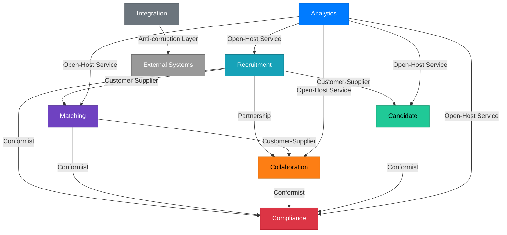
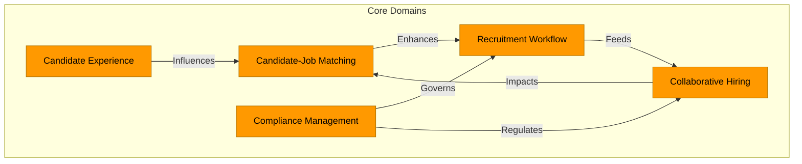
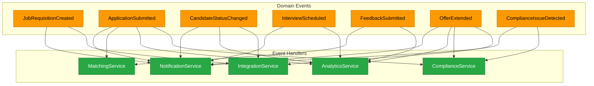
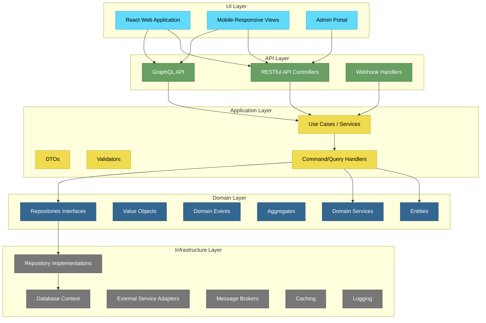
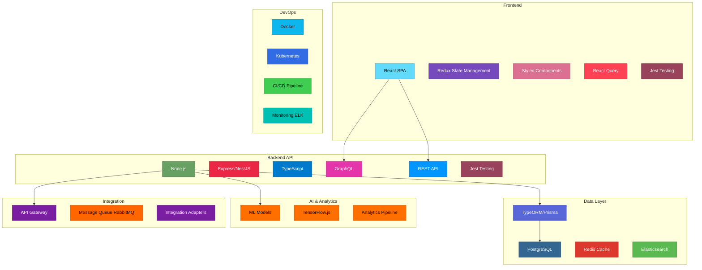

# Applicant Tracking System (ATS) - Description

An Applicant Tracking System (ATS) is a software application that enables the electronic handling of recruitment and hiring processes. Here's a concise and precise description of what an ATS is:

## Core Definition

An Applicant Tracking System (ATS) is a software solution that automates and manages the entire recruitment lifecycle, from job posting to candidate onboarding. It serves as a central database and workflow management tool for all recruitment-related activities.

## Key Components and Functionalities

### 1. Job Requisition Management
- Creation and approval of job openings
- Integration with career sites and job boards
- Job description management and templating

### 2. Candidate Sourcing
- Multi-channel posting to job boards and social media
- Employee referral program management
- Talent pool development and passive candidate management

### 3. Application Processing
- Customizable application forms
- Resume parsing and screening
- Candidate profile creation and management

### 4. Candidate Screening and Assessment
- AI-powered resume screening
- Pre-employment assessment integration
- Disqualification and rejection management

### 5. Interview Management
- Scheduling and calendar integration
- Interview feedback collection
- Video interview platform integration

### 6. Collaboration Tools
- Hiring team communication
- Candidate evaluation and scoring
- Decision-making workflow

### 7. Analytics and Reporting
- Recruitment metrics and KPIs
- Source effectiveness tracking
- Compliance and diversity reporting

### 8. Compliance Management
- EEOC/OFCCP compliance tracking
- Data retention and privacy compliance
- Documentation management

### 9. Offer Management
- Automated offer letter generation
- E-signature capabilities
- Compensation package management

### 10. Onboarding Integration
- Transition to HRIS/onboarding systems
- Background check integration
- New hire documentation management

# 5 Killer Features to Distinguish Your ATS from Competitors

Based on the SWOT analysis of existing ATS platforms, here are five innovative features that could give your new ATS a competitive edge:

## 1. AI-Powered Candidate-Job Fit Prediction

**Feature Description:**
- Advanced machine learning that goes beyond keyword matching to predict candidate success
- Real-time adaptation based on hiring outcomes and performance data
- Transparent AI that explains its recommendations to reduce bias concerns
- Customizable fit models that learn your company's unique success patterns

**Why It's Distinctive:**
While current systems use basic AI for screening, none have fully realized predictive modeling that continuously improves and adapts to company-specific success indicators. This addresses the "steep learning curve" and "complex implementation" weaknesses of existing systems.

## 2. Unified Candidate Experience Platform

**Feature Description:**
- Seamless omnichannel candidate engagement (text, email, social, web)
- Personalized candidate portals with real-time transparency into process
- Interactive career pathing simulations showing growth opportunities
- Built-in candidate feedback loops at every stage of the process

**Why It's Distinctive:**
Current systems struggle with disconnected modules and user experience issues. This feature addresses the "interface issues" weakness and the threat of "rising expectations for consumer-grade UX."

## 3. Collaborative Hiring Intelligence

**Feature Description:**
- Collaborative decision-making tools with built-in bias detection
- Team-based hiring metrics that measure interviewer performance and reliability
- Guided interview intelligence that adjusts questions based on real-time responses
- Consensus-building tools that quantify and visualize team alignment

**Why It's Distinctive:**
While Greenhouse has structured interviewing, no system truly optimizes the collaborative aspects of hiring with real-time intelligence. This addresses the "limited customization for complex workflows" weakness seen in competitors.

## 4. Adaptive Compliance Engine

**Feature Description:**
- Proactive compliance monitoring that adapts to changing regulations globally
- Automatic documentation generation and audit-ready reporting
- Bias and adverse impact detection with mitigation recommendations
- Privacy-first design with regional customization (GDPR, CCPA, etc.)

**Why It's Distinctive:**
Current systems either have strong compliance (at the cost of usability) or weak compliance features. This bridges that gap while addressing the "less comprehensive compliance features" weakness seen in several competitors.

## 5. Talent Ecosystem Integration Hub

**Feature Description:**
- One-click integration with the entire HR tech stack without developer resources
- Universal API that adapts to any HR technology's requirements
- Cross-platform data synchronization with change tracking
- Open marketplace for custom app development with no-code/low-code tools

**Why It's Distinctive:**
Current systems either have limited integrations or require significant technical resources for integration. This addresses the "smaller integration ecosystem" weakness and the "complex implementation" challenges faced by users of existing systems.

Each of these features addresses multiple weaknesses and threats identified in the SWOT analysis while creating a genuinely differentiated product position in the market. These features focus on solving fundamental user problems rather than simply adding incremental improvements to existing functionality.

# Lean Canvas:

## Problem
- Existing ATSs have steep learning curves and poor user experiences
- HR teams struggle with disconnected recruitment tools and data silos
- Companies face compliance risks with changing global regulations
- Current systems fail to meaningfully predict candidate-job fit
- Hiring decisions lack data-driven collaboration and suffer from bias

## Solution
1. AI-Powered Candidate-Job Fit Prediction that learns from your hiring success patterns
2. Unified Candidate Experience Platform for seamless engagement across all channels
3. Collaborative Hiring Intelligence with bias detection and consensus tools
4. Adaptive Compliance Engine that evolves with regional regulations
5. Talent Ecosystem Integration Hub for frictionless HR tech stack integration

## Unique Value Proposition
**Adaptive Talent Intelligence™: The first self-learning ATS that gets smarter with every hire, simplifies compliance, and unifies the entire recruitment ecosystem.**

## Unfair Advantage
- Proprietary machine learning models trained on cross-industry hiring success patterns
- Patent-pending collaborative intelligence framework
- Adaptive compliance technology that evolves with regulatory changes
- Simplified integration architecture requiring zero technical resources

## Customer Segments
- **Early Adopters:**
  - High-growth tech companies (50-500 employees)
  - Forward-thinking mid-market organizations (500-2000 employees)
  - Companies with distributed/remote workforce
  
- **Target Markets:**
  - Industries with high-volume hiring needs (retail, healthcare)
  - Regulated industries requiring robust compliance (finance, healthcare)
  - Companies with global hiring requirements
  - Organizations prioritizing diversity and inclusion

## Key Metrics
- Time-to-hire reduction (target: 30% improvement)
- Candidate satisfaction score (NPS target: >70)
- User adoption rate (target: >90% in first 30 days)
- Hiring manager satisfaction (target: 4.5/5)
- Quality of hire improvement (target: 25% increase)
- Platform integration success rate (target: >95%)
- First-year retention of new hires (target: >85%)

## Channels
- Direct sales team for enterprise clients
- Digital marketing & SEO targeting HR decision-makers
- Strategic partnerships with HRIS/HCM platforms
- HR technology consultants and implementation partners
- Industry conferences and thought leadership
- Free pilot program for qualified early adopters
- Referral program with existing clients

## Cost Structure
- Product development and engineering (45%)
- Sales and marketing (25%)
- Customer success and support (15%)
- Compliance and legal (5%)
- Infrastructure and operations (5%)
- Administration and overheads (5%)

## Revenue Streams
- Subscription-based pricing with tiered models based on hiring volume
- Implementation and onboarding services
- Premium compliance packages for regulated industries
- Advanced analytics and custom reporting add-ons
- White-labeled candidate experience portals
- Integration services and API access fees
- Specialized training and certification programs

This Lean Canvas provides a comprehensive strategic overview for your innovative ATS solution, highlighting how it addresses critical market needs while differentiating from existing competitors through its five killer features.

# MoSCoW Prioritization Matrix for Innovative ATS Solution

## Must Have (Essential Requirements)

| Feature | Description | Rationale |
|---------|-------------|-----------|
| **Core ATS Functionality** | Job requisition management, application processing, candidate management | Foundation of any ATS system; must be present for minimum viable product |
| **Intuitive User Interface** | Clean, modern UI with minimal learning curve | Addresses major weakness of existing systems; critical for adoption |
| **Basic Candidate Fit Matching** | Initial version of AI matching based on skills and requirements | Core differentiator; even basic version adds immediate value |
| **Essential Compliance Tools** | EEOC/OFCCP tracking, data privacy compliance | Legal necessity for any ATS system |
| **Standard Reporting** | Basic metrics on hiring process, time-to-fill, source tracking | Minimum reporting capabilities expected by customers |
| **Mobile Responsiveness** | Mobile-friendly interfaces for both recruiters and candidates | Essential for modern workforce; addresses competitor weaknesses |
| **Interview Scheduling** | Calendar integration and interview coordination | Critical workflow component for recruitment process |
| **Core Integration APIs** | Essential connections to job boards, email, calendars | Minimum integration needs for functional system |

## Should Have (High-Priority Requirements)

| Feature | Description | Rationale |
|---------|-------------|-----------|
| **Enhanced AI Candidate Matching** | Advanced version of predictive job-fit capability | Key differentiator but can be refined post-launch |
| **Collaborative Hiring Tools** | Team evaluation frameworks and feedback collection | Important for collective decision making but can be phased |
| **Candidate Experience Portal** | Personalized candidate dashboards and communications | Critical differentiator but can evolve over time |
| **Automated Compliance Monitoring** | Proactive alerts and guidance on compliance issues | Important but can be enhanced after core compliance tools |
| **Integration Hub (Phase 1)** | First set of pre-built integrations with major HR systems | Important for ecosystem but can be expanded gradually |
| **Bias Detection Tools** | Algorithms to identify potential bias in job descriptions and evaluations | Important differentiator that can be refined over time |
| **Analytics Dashboard** | Visual representation of hiring metrics and KPIs | Should be included early but can be enhanced iteratively |
| **Multi-channel Candidate Communication** | Email, text, and in-app messaging capabilities | Important for engagement but can be expanded gradually |

## Could Have (Desirable Requirements)

| Feature | Description | Rationale |
|---------|-------------|-----------|
| **Advanced Collaborative Intelligence** | Real-time interview guidance and consensus visualization | Innovative but can be developed after establishing core capabilities |
| **Global Compliance Adaptation** | Region-specific compliance features and automation | Important for global companies but can be phased by region |
| **No-Code Customization Tools** | User ability to customize workflows without technical help | Valuable feature but not essential for initial market entry |
| **Talent CRM Capabilities** | Passive candidate nurturing and relationship management | Valuable extension but secondary to core ATS functions |
| **Employer Branding Tools** | Customizable career sites and brand presence management | Desirable but not core to initial differentiation strategy |
| **Video Interview Integration** | Native video interviewing capabilities | Useful but can be addressed via integrations initially |
| **Integration Hub (Phase 2)** | Expanded integration ecosystem with niche HR tools | Expansion of initial integration capabilities |
| **Candidate Success Prediction** | Long-term performance prediction beyond initial job fit | Advanced feature dependent on data collection over time |

## Won't Have (Future Considerations)

| Feature | Description | Rationale |
|---------|-------------|-----------|
| **Full HRIS Functionality** | Complete human resource information system capabilities | Outside core focus; better addressed through integrations |
| **Employee Performance Management** | Ongoing performance tracking after hiring | Post-hiring feature outside core ATS scope |
| **Payroll Integration** | Direct payroll system functionality | Better handled by dedicated systems with integration |
| **Virtual Reality Interviews** | VR-based interview environments | Emerging technology but too niche for initial product |
| **Blockchain Credential Verification** | Distributed ledger for education/experience verification | Interesting but not mature enough for immediate inclusion |
| **Full Onboarding System** | Complete new hire onboarding functionality | Better as integration with specialized onboarding systems |
| **Learning Management System** | Training and development for new hires | Outside core recruitment focus |
| **Contractor Management Tools** | Specialized features for managing contingent workforce | Future expansion area after core ATS is established |

This MoSCoW matrix provides a clear prioritization framework for your ATS development, ensuring that essential differentiating features are built first while maintaining a roadmap for future enhancements that will continue to separate your product from competitors.

# Product Requirements Document (PRD)

## Document Control
- **Document Status:** Draft
- **Version:** 1.0
- **Last Updated:** [Current Date]

## Executive Summary

Adaptive Talent Intelligence™ is a next-generation Applicant Tracking System designed to overcome the limitations of existing solutions through advanced AI, seamless user experience, and intelligent collaboration tools. The product addresses key pain points in the recruitment process including poor candidate experiences, disconnected tools, compliance challenges, and ineffective candidate evaluation.

This PRD outlines the specific requirements, features, and specifications for the first release of the platform, with a focus on the five key differentiators:
1. AI-Powered Candidate-Job Fit Prediction
2. Unified Candidate Experience Platform
3. Collaborative Hiring Intelligence
4. Adaptive Compliance Engine
5. Talent Ecosystem Integration Hub

## Product Vision

To create the most intelligent, user-friendly, and adaptive recruitment platform that evolves with each organization's unique hiring needs while ensuring compliance, reducing bias, and creating exceptional experiences for both candidates and hiring teams.

## Target Users

### Primary Users
1. **Recruiters**
   - In-house talent acquisition professionals
   - Agency recruiters partnering with organizations
   - Recruiting coordinators

2. **Hiring Managers**
   - Department leaders overseeing hiring decisions
   - Team leads participating in the evaluation process
   - Executives overseeing strategic hiring

3. **Candidates**
   - Active job seekers
   - Passive candidates in nurture campaigns
   - Internal candidates seeking new roles

### Secondary Users
1. **HR Leaders**
   - CHROs and HR Directors overseeing recruitment
   - People operations managers
   - Talent management specialists

2. **Compliance Officers**
   - Legal teams monitoring hiring compliance
   - Diversity and inclusion specialists
   - Data privacy officers

3. **System Administrators**
   - HR technology managers
   - HRIS administrators
   - IT support personnel

## User Stories and Requirements

### Core ATS Functionality

#### Job Requisition Management
1. As a recruiter, I need to create, edit, and publish job requisitions with appropriate approvals
2. As a hiring manager, I need to request new positions with justifications and requirements
3. As an HR leader, I need to approve job requisitions before they are published
4. As a recruiter, I need to post jobs to multiple channels simultaneously

#### Application Processing
1. As a candidate, I need to apply for positions with minimal friction
2. As a recruiter, I need to view and manage applications in a unified dashboard
3. As a system administrator, I need to customize application forms for different positions
4. As a compliance officer, I need to track equal opportunity data separate from screening

#### Candidate Management
1. As a recruiter, I need to track candidate status throughout the hiring process
2. As a hiring manager, I need to view candidate profiles and make decisions
3. As a recruiter, I need to communicate with candidates directly through the platform
4. As a talent manager, I need to add candidates to talent pools for future opportunities

### Key Differentiators

#### 1. AI-Powered Candidate-Job Fit Prediction
1. As a recruiter, I need AI-based matching of candidates to positions based on skills, experience, and potential
2. As a hiring manager, I need to understand why a candidate was recommended for my position
3. As an HR leader, I need to customize fit algorithms based on our company's unique success factors
4. As a compliance officer, I need transparency in how AI makes recommendations to ensure fairness

**Technical Requirements:**
- Machine learning model that continuously improves based on hiring outcomes
- Explainable AI that provides reasoning for matches and recommendations
- Customizable weighting of different factors in the matching algorithm
- Regular retraining based on new data with version control

#### 2. Unified Candidate Experience Platform
1. As a candidate, I need a personalized dashboard showing my application status
2. As a recruiter, I need to provide consistent messaging across all communication channels
3. As a candidate, I need mobile-optimized interfaces for every stage of the process
4. As a hiring manager, I need to deliver a branded, professional experience to candidates

**Technical Requirements:**
- Responsive design for all user interfaces
- Omnichannel communication framework (email, SMS, chat)
- Personalization engine to customize candidate experience
- White-labeling capabilities for employer branding

#### 3. Collaborative Hiring Intelligence
1. As a hiring team, we need to evaluate candidates collaboratively with structured feedback
2. As a recruiter, I need to identify and address evaluation bias in real-time
3. As a hiring manager, I need to align team assessments and build consensus
4. As an interviewer, I need guidance on effective questioning tailored to the candidate

**Technical Requirements:**
- Real-time collaboration tools with simultaneous editing capability
- Bias detection algorithms with contextual suggestions
- Structured evaluation templates with customization options
- Interview intelligence that adapts questions based on previous responses

#### 4. Adaptive Compliance Engine
1. As a compliance officer, I need to ensure hiring processes meet all legal requirements
2. As a global HR leader, I need region-specific compliance rules applied automatically
3. As a recruiter, I need guidance on compliance issues before they become problems
4. As an HR director, I need audit-ready documentation of all compliance measures

**Technical Requirements:**
- Regulatory update monitoring and automatic system adjustment
- Geolocation-based compliance rule application
- Proactive compliance checking before actions are completed
- Comprehensive audit logging and report generation

#### 5. Talent Ecosystem Integration Hub
1. As a system administrator, I need simple, code-free integration with our HR tech stack
2. As a recruiter, I need seamless data flow between recruitment tools and platforms
3. As an HR leader, I need a unified view of data across multiple HR systems
4. As an IT manager, I need secure, compliant data sharing between platforms

**Technical Requirements:**
- Universal API with adaptive connectors
- Pre-built integrations for major HR systems
- Data transformation and normalization capabilities
- Secure authentication and authorization framework

## User Interface and Experience Requirements

### General UI/UX Requirements
- Clean, modern interface with minimal visual clutter
- Intuitive navigation requiring minimal training
- Consistent design language across all platform components
- Accessibility compliance with WCAG 2.1 AA standards
- Responsive design for all screen sizes and devices

### Recruiter Dashboard
- Visual pipeline representation with drag-and-drop functionality
- Consolidated task list with priority indicators
- Real-time notifications and alerts
- Customizable views and saved filters

### Candidate Portal
- Progress visualization for application status
- Scheduling tools for interview selection
- Secure document upload and management
- Branded, professional design matching employer identity

### Hiring Manager Interface
- Quick candidate comparison views
- Mobile-optimized interview feedback forms
- Team evaluation consensus visualization
- Calendar integration for availability management

## Technical Requirements

### Performance and Scalability
- Page load times under 2 seconds for all primary functions
- Support for organizations with up to 50,000 employees
- Handling of up to 100,000 applications per month
- Concurrent user support for up to 1,000 users
- 99.9% uptime guarantee during business hours

### Security and Compliance
- SOC 2 Type II compliance
- GDPR and CCPA compliance by design
- End-to-end encryption for sensitive data
- Role-based access control with granular permissions
- Regular security audits and penetration testing

### Integration Capabilities
- RESTful API for all system functions
- Webhook support for event-driven integrations
- OAuth 2.0 authentication for third-party applications
- Bulk import/export capabilities
- Real-time data synchronization where applicable

### Data and Analytics
- Standard reporting package with key recruitment metrics
- Custom report builder with drag-and-drop interface
- Data visualization dashboard with interactive elements
- Export capabilities in multiple formats (CSV, Excel, PDF)
- Scheduled report delivery via email

## Implementation Requirements

### Deployment Options
- Cloud-hosted SaaS as primary delivery model
- Optional private cloud deployment for enterprise customers
- Single sign-on integration with major identity providers
- Automated backup and disaster recovery

### Onboarding and Configuration
- Guided setup wizard for initial configuration
- Template library for common recruitment workflows
- Bulk data import tools for existing candidate information
- Role and permission template library

### Training and Support
- Interactive in-app guidance and tooltips
- Video tutorial library for all major functions
- Knowledge base with searchable documentation
- Live chat support during business hours
- Priority support option for enterprise customers

## Success Metrics

### Product Performance Metrics
- User adoption rate: >90% of target users active within 30 days
- Feature utilization: >80% of key features used regularly
- System stability: <0.1% error rate in core functions
- Integration success: >95% of attempted integrations successful

### Customer Success Metrics
- Time-to-hire reduction: 30% improvement from baseline
- Cost-per-hire reduction: 25% improvement from baseline
- Quality of hire improvement: 25% increase in first-year retention
- User satisfaction: NPS >70 for both recruiters and candidates

## Release Planning

### Phase 1: MVP (3 months)
- Core ATS functionality
- Basic candidate matching algorithms
- Essential compliance tools
- Standard reporting
- Foundational integration capabilities

### Phase 2: Key Differentiators (6 months)
- Enhanced AI candidate matching
- Candidate experience portal V1
- Basic collaborative hiring tools
- Compliance monitoring capabilities
- Integration hub with initial partners

### Phase 3: Advanced Features (9 months)
- Predictive analytics for candidate success
- Full collaborative intelligence suite
- Advanced compliance automation
- Expanded integration ecosystem
- Enhanced mobile capabilities

## Dependencies and Constraints

### Dependencies
- Access to high-quality training data for AI algorithms
- Integration cooperation from key HR technology partners
- Compliance with emerging privacy regulations
- User research for iterative UX improvements

### Constraints
- Time-to-market pressure from competitive landscape
- Balance between feature richness and usability
- Technical debt management during rapid development
- Compliance with varying regional requirements

## Appendices

### Glossary of Terms
- **ATS**: Applicant Tracking System
- **AI**: Artificial Intelligence
- **ML**: Machine Learning
- **CRM**: Candidate Relationship Management
- **EEOC**: Equal Employment Opportunity Commission
- **OFCCP**: Office of Federal Contract Compliance Programs
- **GDPR**: General Data Protection Regulation
- **CCPA**: California Consumer Privacy Act

### Competitive Analysis Summary
- Reference to detailed competitive analysis document
- Key differentiation points from major competitors
- Market positioning strategy

### User Research Findings
- Summary of key user interviews
- Prioritized pain points from research
- Validation of key feature hypotheses

---

This PRD provides a comprehensive overview of requirements for the Adaptive Talent Intelligence™ ATS platform. It will be refined through stakeholder feedback and evolve as development progresses.

# bounded contexts:

```mermaid
graph TD
    subgraph Recruitment Context
        RC1[Job Requisition Management]
        RC2[Job Posting]
        RC3[Candidate Pipeline]
    end
    
    subgraph Matching Context
        MC1[AI Matching Engine]
        MC2[Skills Analysis]
        MC3[Predictive Performance]
    end
    
    subgraph Collaboration Context
        CC1[Interview Management]
        CC2[Feedback Collection]
        CC3[Decision Support]
        CC4[Bias Detection]
    end
    
    subgraph Compliance Context
        CoC1[Regulatory Management]
        CoC2[Audit Trails]
        CoC3[Data Privacy]
    end
    
    subgraph Candidate Context
        CaC1[Application Process]
        CaC2[Candidate Portal]
        CaC3[Communication Management]
    end
    
    subgraph Integration Context
        IC1[API Gateway]
        IC2[Integration Hub]
        IC3[Data Transformation]
    end
    
    subgraph Analytics Context
        AC1[Metrics Engine]
        AC2[Report Builder]
        AC3[Dashboard Service]
    end
    
    style RC1 fill:#17a2b8,stroke:#117a8b,color:#ffffff
    style RC2 fill:#17a2b8,stroke:#117a8b,color:#ffffff
    style RC3 fill:#17a2b8,stroke:#117a8b,color:#ffffff
    style MC1 fill:#6f42c1,stroke:#553098,color:#ffffff
    style MC2 fill:#6f42c1,stroke:#553098,color:#ffffff
    style MC3 fill:#6f42c1,stroke:#553098,color:#ffffff
    style CC1 fill:#fd7e14,stroke:#c96a11,color:#000000
    style CC2 fill:#fd7e14,stroke:#c96a11,color:#000000
    style CC3 fill:#fd7e14,stroke:#c96a11,color:#000000
    style CC4 fill:#fd7e14,stroke:#c96a11,color:#000000
    style CoC1 fill:#dc3545,stroke:#bd2130,color:#ffffff
    style CoC2 fill:#dc3545,stroke:#bd2130,color:#ffffff
    style CoC3 fill:#dc3545,stroke:#bd2130,color:#ffffff
    style CaC1 fill:#20c997,stroke:#199d76,color:#000000
    style CaC2 fill:#20c997,stroke:#199d76,color:#000000
    style CaC3 fill:#20c997,stroke:#199d76,color:#000000
    style IC1 fill:#6c757d,stroke:#565e64,color:#ffffff
    style IC2 fill:#6c757d,stroke:#565e64,color:#ffffff
    style IC3 fill:#6c757d,stroke:#565e64,color:#ffffff
    style AC1 fill:#007bff,stroke:#0069d9,color:#ffffff
    style AC2 fill:#007bff,stroke:#0069d9,color:#ffffff
    style AC3 fill:#007bff,stroke:#0069d9,color:#ffffff
```

# C4 diagrams
## C1 diagram

## Context map

## Core domain

## event driven architecture

## High-level clean architecture

## Key aggregates entities

## Supporting domain

## Technology stack architecture
