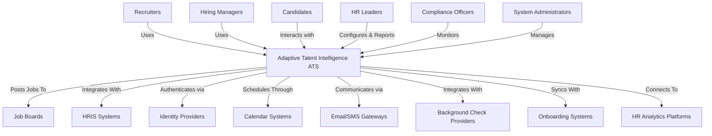
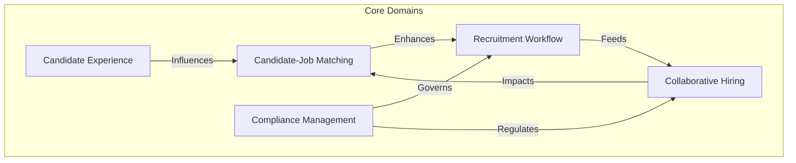
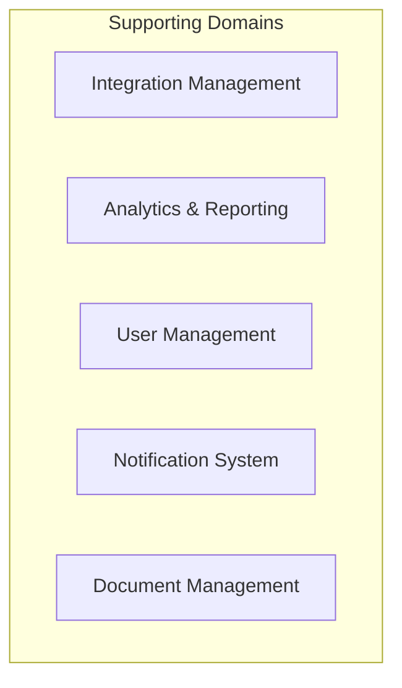
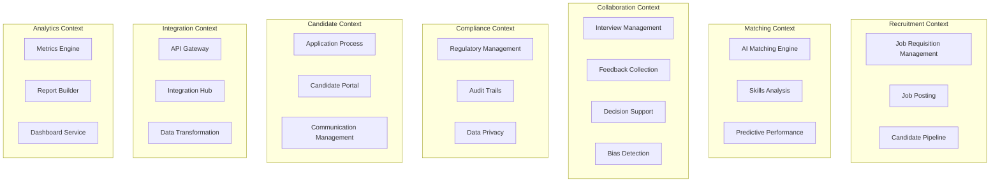
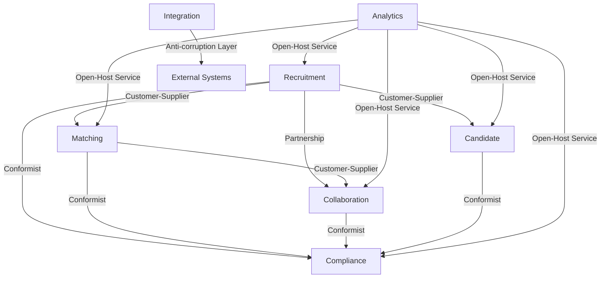
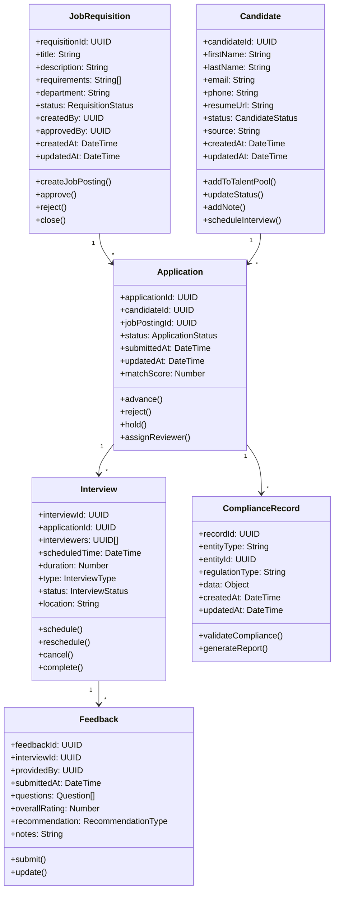
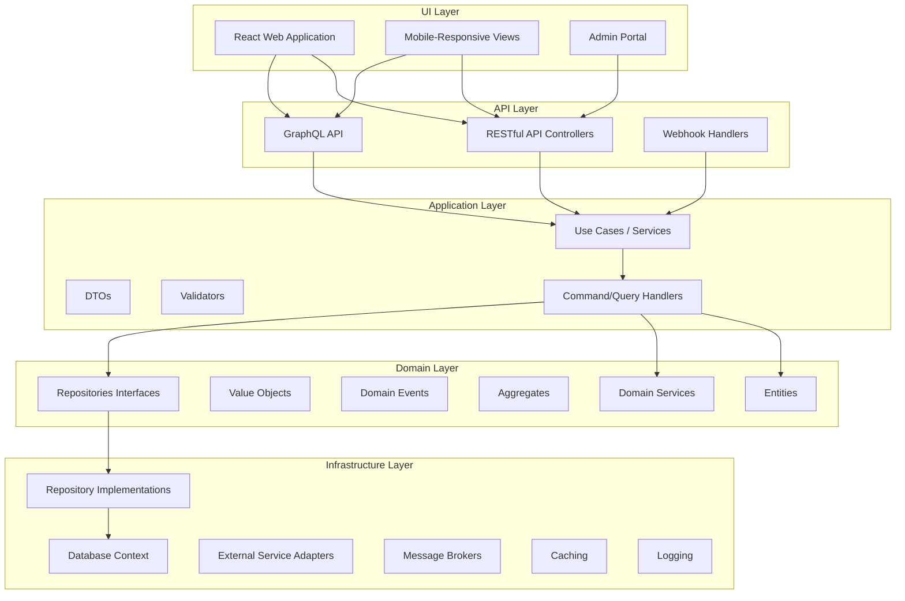
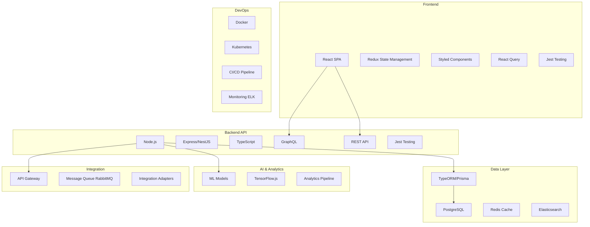
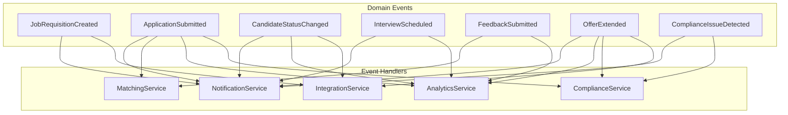

# Architecture Document: Adaptive Talent Intelligence™ ATS

## 1. Introduction

This document outlines the architecture of the Adaptive Talent Intelligence™ ATS platform, a next-generation Applicant Tracking System designed to revolutionize recruitment processes through advanced AI, unified experiences, intelligent collaboration, adaptive compliance, and seamless integration.

### 1.1 Purpose

The purpose of this architecture document is to provide a comprehensive technical blueprint for the development team, stakeholders, and future maintainers of the system. It captures the significant architectural decisions, system components, and interactions that fulfill the requirements specified in the PRD.

### 1.2 Scope

This document covers the architecture of all major components of the Adaptive Talent Intelligence™ ATS, including:
- System context and boundaries
- Domain model and bounded contexts
- Technical architecture and patterns
- Data architecture
- Integration approach
- Deployment model

## 2. Architectural Goals and Constraints

### 2.1 Architectural Goals

1. **Scalability**: Support organizations from small businesses to enterprises with up to 50,000 employees
2. **Flexibility**: Enable customization without code changes
3. **Performance**: Ensure responsive user experience with page load times under 2 seconds
4. **Security**: Protect sensitive candidate and organization data
5. **Maintainability**: Facilitate ongoing development with clean architecture principles
6. **Interoperability**: Seamlessly integrate with existing HR systems and tools

### 2.2 Constraints

1. **Compliance Requirements**: Must adhere to global recruitment regulations (GDPR, CCPA, EEOC, etc.)
2. **Time-to-Market**: Competitive landscape requires rapid development and release cycles
3. **Technical Complexity**: Advanced AI features require specialized expertise
4. **User Experience Expectations**: Must surpass existing ATS usability standards

## 3. System Context

### 3.1 Context Diagram

The system interacts with various users and external systems as depicted in the following context diagram:



### 3.2 User Personas

1. **Recruiters**: Primary daily users managing the recruitment process
2. **Hiring Managers**: Evaluate candidates and make hiring decisions
3. **Candidates**: Apply for positions and interact with the hiring process
4. **HR Leaders**: Configure and monitor the recruitment strategy
5. **Compliance Officers**: Ensure adherence to regulations
6. **System Administrators**: Manage technical aspects of the system

### 3.3 External Systems

1. **Job Boards**: Platforms for posting job openings (LinkedIn, Indeed, etc.)
2. **HRIS Systems**: Core HR information systems for employee data
3. **Identity Providers**: Authentication services (OAuth, SAML)
4. **Calendar Systems**: Scheduling platforms (Google Calendar, Outlook)
5. **Communication Gateways**: Email and SMS providers
6. **Background Check Services**: Pre-employment verification systems
7. **Onboarding Systems**: New hire processing platforms
8. **HR Analytics Platforms**: Advanced reporting and analytics tools

## 4. Domain Architecture

### 4.1 Strategic Domain Model

The domain is structured according to Domain-Driven Design principles with the following core and supporting domains:

#### 4.1.1 Core Domains



#### 4.1.2 Supporting Domains



### 4.2 Bounded Contexts

The system is divided into the following bounded contexts with clear responsibilities:



### 4.3 Context Map

The context map defines relationships between bounded contexts:



### 4.4 Key Aggregates and Entities

The domain model includes the following key aggregates and entities:



## 5. Technical Architecture

### 5.1 Architectural Style

The system employs a hybrid architectural style combining:
- Clean Architecture for separation of concerns
- Domain-Driven Design for business complexity management
- Event-Driven Architecture for loose coupling
- Microservices-ready approach for scalability

### 5.2 Component Architecture

The system is organized using a layered architecture following clean architecture principles:



### 5.3 Technology Stack

The implementation will use the following technology stack:



### 5.4 Event-Driven Architecture

The system employs domain events to enable loose coupling between components:



## 6. Data Architecture

### 6.1 Data Storage Strategy

The system employs a polyglot persistence approach:

1. **PostgreSQL**: Primary relational database for transactional data
   - Core domain entities
   - Relationship management
   - Transaction consistency

2. **Elasticsearch**: Search and analytics engine
   - Candidate and job searching
   - Full-text resume analysis
   - Analytics data warehouse

3. **Redis**: In-memory data store
   - Caching layer
   - Session management
   - Real-time collaboration data

### 6.2 Database Schema Overview

The PostgreSQL schema follows a normalized approach with strategic denormalization for performance:

#### 6.2.1 Core Tables

- `organizations`
- `users`
- `roles_permissions`
- `job_requisitions`
- `job_postings`
- `candidates`
- `applications`
- `interviews`
- `feedback`
- `offers`
- `compliance_records`

#### 6.2.2 Supporting Tables

- `skills`
- `departments`
- `locations`
- `job_categories`
- `tags`
- `audit_logs`
- `notifications`
- `documents`
- `integration_configs`

### 6.3 Data Access Patterns

1. **Repository Pattern**: Domain-oriented data access abstraction
2. **Command Query Responsibility Segregation (CQRS)**: Separate optimized paths for reads and writes
3. **Data Mapper**: ORM with TypeORM/Prisma for entity mapping
4. **Read Models**: Optimized projections for specific query needs

## 7. Integration Architecture

### 7.1 API Strategy

1. **GraphQL API**: Primary API for the frontend application
   - Flexible querying capabilities
   - Type-safe schema
   - Real-time subscriptions

2. **REST API**: Secondary API for broader integration
   - Resource-oriented endpoints
   - Standard HTTP methods
   - Comprehensive documentation

3. **Webhooks**: Event notification mechanism
   - Subscription-based notifications
   - Payload delivery for system events
   - Retry mechanisms for reliability

### 7.2 Integration Hub

The Talent Ecosystem Integration Hub provides:

1. **Universal Connectors**: Pre-built integrations with major HR systems
2. **API Transformations**: Data mapping and transformation services
3. **Workflow Triggers**: Event-based workflow initiation
4. **No-Code Configuration**: Visual integration builder for administrators

### 7.3 Authentication and Authorization

1. **OAuth 2.0/OpenID Connect**: Standard authentication protocol
2. **Role-Based Access Control (RBAC)**: Permission management
3. **API Keys**: Secure machine-to-machine authentication
4. **Single Sign-On (SSO)**: Integration with identity providers

## 8. Security Architecture

### 8.1 Security Principles

1. **Defense in Depth**: Multiple security controls
2. **Least Privilege**: Minimal required access
3. **Privacy by Design**: Built-in data protection
4. **Secure Defaults**: Safe initial configurations

### 8.2 Key Security Controls

1. **Data Encryption**: End-to-end and at-rest encryption
2. **Input Validation**: Prevention of injection attacks
3. **Rate Limiting**: Protection against abuse
4. **Audit Logging**: Comprehensive activity tracking
5. **Regular Security Testing**: Ongoing vulnerability assessment

### 8.3 Compliance Architecture

1. **Regulatory Mapping**: Association of requirements to features
2. **Data Classification**: Identification of sensitive information
3. **Regional Configuration**: Geo-specific compliance settings
4. **Audit Trail**: Immutable record of compliance activities

## 9. Deployment Architecture

### 9.1 Deployment Model

The system is designed for cloud-native deployment:

1. **Primary Model**: SaaS multi-tenant architecture
2. **Alternative Model**: Private cloud deployment for enterprise customers

### 9.2 Infrastructure Components

1. **Containerization**: Docker-based microservices
2. **Orchestration**: Kubernetes cluster management
3. **Load Balancing**: Traffic distribution and failover
4. **Auto-scaling**: Dynamic resource allocation
5. **CDN**: Global content delivery

### 9.3 DevOps Pipeline

1. **CI/CD Pipeline**: Automated build, test, and deployment
2. **Infrastructure as Code**: Terraform-based infrastructure management
3. **Monitoring and Alerting**: ELK stack for system observation
4. **Disaster Recovery**: Automated backup and restoration

## 10. Cross-Cutting Concerns

### 10.1 Logging and Monitoring

1. **Structured Logging**: JSON-formatted logs
2. **Centralized Log Collection**: Aggregated log management
3. **Metrics Collection**: Performance and usage statistics
4. **Real-time Alerts**: Proactive issue notification

### 10.2 Error Handling

1. **Global Error Strategy**: Consistent error management
2. **Fault Tolerance**: Graceful degradation
3. **Circuit Breakers**: Protection against cascading failures
4. **Retry Policies**: Automatic recovery attempts

### 10.3 Performance Optimization

1. **Caching Strategy**: Multi-level caching
2. **Asynchronous Processing**: Background job execution
3. **Connection Pooling**: Database connection management
4. **Resource Optimization**: Efficient resource utilization

## 11. Architectural Evolution

### 11.1 Phase 1: Monolithic Approach

Initial implementation as a modular monolith for rapid development:
- Clear bounded contexts with internal module boundaries
- Shared database with schema separation
- Domain events within the application boundary

### 11.2 Phase 2: Service Extraction

Gradual extraction of bounded contexts into separate services:
- Matching Engine as first microservice
- Compliance Management as second microservice
- API Gateway for unified frontend experience

### 11.3 Phase 3: Full Microservices

Complete transition to microservices architecture:
- Independent deployability of all bounded contexts
- Dedicated databases per service
- Event-driven communication between services

## 12. Implementation Guidelines

### 12.1 Code Organization

Backend code organization follows Clean Architecture principles:
```
src/
├── api/
│   ├── controllers/
│   ├── middlewares/
│   ├── routes/
│   └── validators/
├── application/
│   ├── commands/
│   ├── queries/
│   ├── dtos/
│   └── services/
├── domain/
│   ├── entities/
│   ├── events/
│   ├── repositories/
│   └── services/
├── infrastructure/
│   ├── database/
│   ├── external/
│   ├── messaging/
│   └── repositories/
└── shared/
    ├── constants/
    ├── errors/
    ├── logger/
    └── utils/
```

Frontend code organization follows feature-based structure:
```
src/
├── components/
│   ├── common/
│   ├── layouts/
│   └── ui/
├── features/
│   ├── recruitment/
│   ├── candidates/
│   ├── interviews/
│   ├── matching/
│   └── compliance/
├── hooks/
├── services/
├── state/
├── types/
└── utils/
```

### 12.2 Development Standards

1. **Coding Standards**: TypeScript-enforced standards with ESLint
2. **Testing Strategy**: TDD approach with unit, integration, and E2E tests
3. **Documentation**: OpenAPI/Swagger for APIs, JSDoc for code
4. **Code Review**: Required peer review with automated quality checks

## 13. Conclusion

The architecture described in this document provides a comprehensive foundation for building the Adaptive Talent Intelligence™ ATS platform. It addresses the core requirements while establishing patterns that allow for scalability, flexibility, and maintainability as the system evolves.

The architecture specifically supports the five key differentiators:
1. AI-Powered Candidate-Job Fit Prediction through the Matching Context
2. Unified Candidate Experience Platform via the Candidate Context
3. Collaborative Hiring Intelligence within the Collaboration Context
4. Adaptive Compliance Engine in the Compliance Context
5. Talent Ecosystem Integration Hub through the Integration Context

This architecture balances immediate delivery needs with long-term strategic goals, providing a roadmap for incremental implementation while maintaining a cohesive vision.
